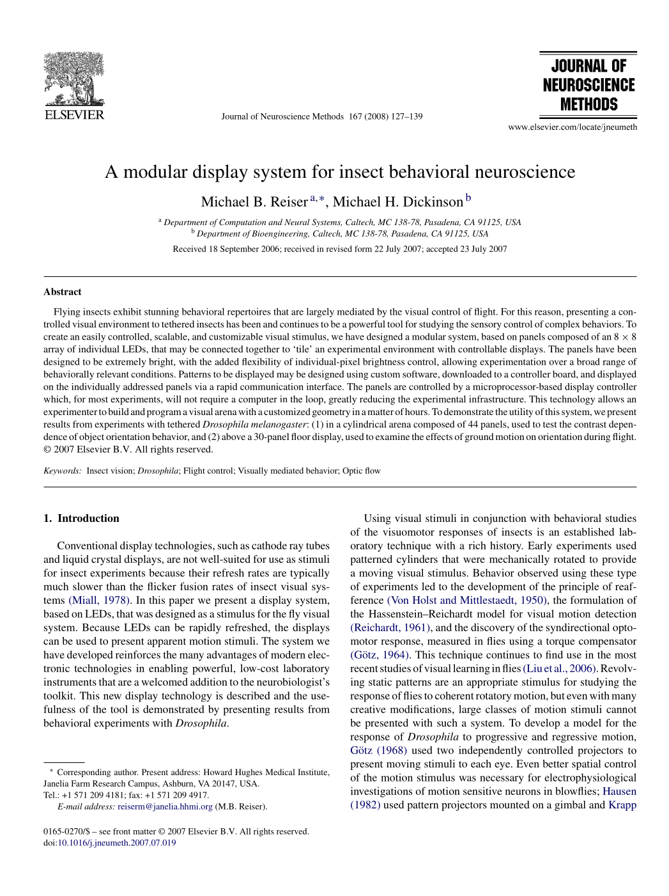

# Documentation guidelines


The intention of this page is to communicate. The headers, text, and images follow standard layout conventions. Important parts like **notes** or **warnings** are highlighted by **bold** text. Monospaced font with gray background is used for code snippets and file paths. For example, `clear; disp("Hello World");` would be code and `/home/reiserlab/Documents` or `C:\Users\Reiserlab\Documents\` would describe directories.

When we describe the interaction with graphical user interfaces (GUI), we use a gray background with colored text for any element that should be shown on the screen. For example, *Refresh Rate: 1000Hz*{:.gui-txt} means, that we refer to the text "Refresh Rate: 1000Hz" shown on a GUI. If we talk about button that can be clicked, then *OK*{:.gui-btn} would be an example for a confirmation button.


## How is the page created?

All documentation you see on this page is generate from markdown documents. Markdown is a simple text based way of structuring text documents. This means, you can read these markdown documents in any text editor or on github without additional software. The markup should be intuitive and not distract you from reading, for example if you want to *emphasize* a word, you just put an asterisk before and after the word like so: \*emphasize\*. If you want to make it **bold**, put two asterisk. That is unintrusive and potentially even intuitive. 

The advantage besides easily generating websites from it is, that it reduces the software stack required to read and write documentation. What this means: If you spot an error, you can also directly edit (for example) [this file]({{ site.github. repository_url }}/edit/master/Guidelines.md) on github or use [many other ways](Contact) to make us aware of your suggestion.

## Basic elements

The markdown documents are parsed into the simple, but hopefully functional layout of this webpage. The following example of a markdown generates headers, links, and images:

```markdown
# Header Level 1

This is some text with a [link to the Reiser Lab website](https://www.janelia.org/lab/reiser-lab).

## Header Level 2

1. markdown is easy to read, even if not parsed
2. for example, this is an ordered list
3. followed by an image: 



```

This page uses [kramdown](https://kramdown.gettalong.org/) to generate html from the markdown files. If you have any more exciting ideas how to format your text, for example using tables, syntax highlighting for code blocks, or blockquotes, then have a look at [kramdown's excellent documentation](https://kramdown.gettalong.org/syntax.html) – or just let us know what you want to do.


# You repo on this page

If you want your git repository included in the page, then please [get in contact](Contact). We could then discuss which menu item would be best fitting your code, hardware, or documentation.