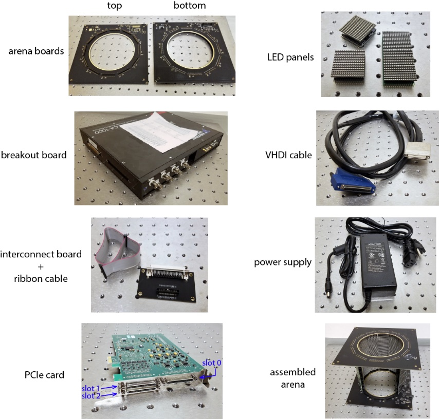
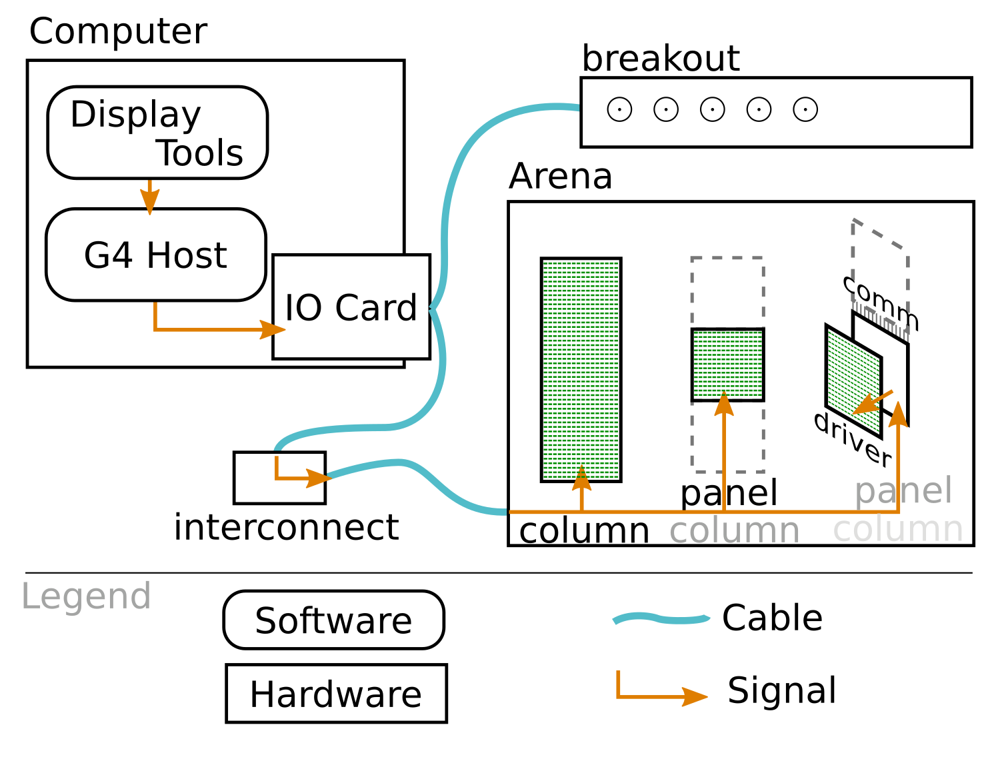
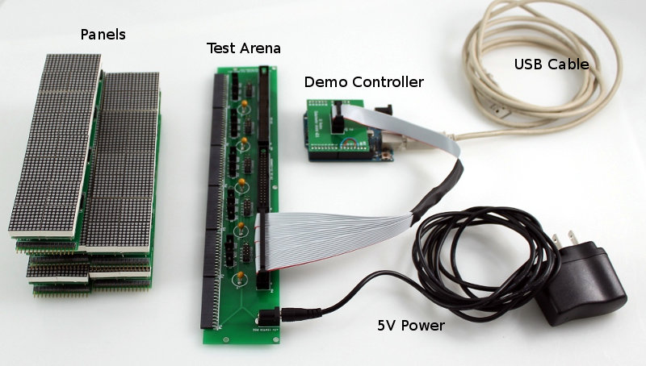

Here we describe what is needed to operate a Modular LED Display of the 4th generation. The first part concerns the knowledge necessary to make the decisions for hardware acquisition in the second part.

1. TOC
{:toc}

# Knowledge

You probably have a use case in mind when reading this. You can still learn about the initial motivation to develop modular LED Displays at ["Theory and Practice of Insect Flight Simulators."](../Generation 3/Software/docs/g2-user-guide.md)

## Parts overview

{:.ifr .pop}

Fundamentally, G4 is about turning a light source on and off, possibly at different brightnesses and at well defined times. The light source for modular LED displays is Light Emitting Diodes (LED), which typically issue a well-defined spectrum of light. The G4 system combines 256 LEDs into a 16×16 matrix, which we call "Panel." Each panel is a flat square measuring 40×40mm² (about 1.6×1.6 inches). Panels are organized in columns and arenas. A column consists of up to four directly connected panels, forming a maximum area of 160×40mm² with up to 1024 LEDs. Up to 12 columns can be combined into an "Arena." The arena is connected to a specialized PCIe IO card in a Windows computer through an interconnect board. Optionally, this IO card can also connect to a breakout box, which exposes some of the signals for recording. The "G4 Host" software on the computer interacts with the hardware and provides an API for the arena. User-friendly applications like the ["Display Tools"](G4-index.md) can then be used to turn any of these 12,288 light sources on or off, up to 1500 times per second. The following paragraph gives more detail about what is necessary to address these more than 10,000 LEDs.

{:.ifr .pop}

To understand the working principle in more detail, here a step through from the users' side: Using convenient tools like the Display Tools, you can define stimuli you want to show. This description of the stimuli is sent to the "G4 Host", another application running in the computer background. When starting the G4 Host, this software automatically programs the specialized I/O card for high throughput and low latency communication with the arena. This PCIe card is a Field-Programmable Gate Array (FPGA) and is used by the G4 system to generate four different SPI communication channels. Once the G4 Host receives a command containing a stimuli description, the PCIe card sends these signals to the arena. The arena then splits the four SPI channels top the different columns. The columns consist of panels consisting of two separate boards: The communication board connected to the arena board and the adjacent panels, and the driver board with all the LEDs. The communication board has a microcontroller unit (MCU) that receives the incoming SPI signal, filtering for signals meant for this specific panel, and then forwards this signal to one of four connectors to the driver board. On the driver board, each of the connectors has its own MCU, which then translates the signal into corresponding on/off signals for the LEDs. The five MCUs per panel need to be preprogrammed before assembly to operate correctly. But we will come back to each of those points during the assembly.

## Capabilities

The G4 displays can show 16-bit stimuli with up to 500Hz and 1500Hz for purely turning them on and off. Different forms of arena boards can be used to place the 40×40mm² panels, each with 16×16 LEDs in columns up to 4 panels in height. An arena can drive up to 12 columns.

While the complexity and capability of the G4 displays have increased over previous generations, they are more accessible and easy to use through a set of advanced software tools. These "Display Tools" can be used to defined patterns and movements, arrange them into complex experimental protocols, and run data analysis on the results. These easy to use GUIs modify script which can be further customized by advanced users, should the experimental requirements go beyond what the current set of "Display Tools" supports.

## The difference from Generation 3

The main differences from [Generation 3](../Generation 3) are:

- size
- refresh regime
- transfer protocol
- no address
- refresh frequency

More specifically, the size of the G4 panel is 40×40mm² instead of 32×32mm² for G3. Within a panel area, the number of LEDs increased from 8×8 in G3 to 16×16 in G4. Consequently, G4 has an LED every 2.5mm at a higher density than the 4mm distance between LEDs in G3.

Technically, the displays now show synchronous controller driven updates, which means that patterns are only shown when the controller is sending data.

This data transfer regime is possible since the communication between the controller and the panel changed to  Serial Peripheral Interface (SPI) from the previously used I²C in the previous generations.

The location of panels within the arena is defined by its position in the setup. Previous generations required that individual panels would be pre-programmed for a place within the setup. In G4, each panel's address is defined by the column and the position within the column. Learn more details about this in the [subsection about placeholders](#placeholder).

G4 panels can refresh at 500 frames per second with different brightness levels or up to 1500 frames per second for turning the LEDs on or off. The refresh rate on the G3 depends on the number of panels per arena and different other factors. It would typically be between 68 frames for a full arena at eight brightness levels but up to 2600Hz for a single panel with binary patterns. In summary, the G4 system generates reliable refresh rates across different experimental settings.

# Hardware

Some parts of the G4 Modular LED Display needs to be produced; some can be bought. This website contains detailed information about the parts you need to make, and we provide example links to where you can buy the other parts.

## Sources

Some parts for the G4 arena [can be bought](G4-COTS.md), but all the PCBs need to be customized and produced to your requirements. And producing PCBs takes time.

A typical turn-around time for assemblers from the moment they receive the files to the moment you receive the hardware is one month. Over time and between manufacturers, the production process differs. Manufacturers adjust the provided files, which sometimes means that the same set of files produce more or less reliable results between batches. If you are thinking about making larger volumes of either board, we strongly recommend running a smaller batch and thoroughly testing that hardware. Once you have verified the results, order a larger volume from the same manufacturer. At each step of the process, try to get the files from the manufacturer that they used to produce your batch. This is important for your own reference and for ordering replacements and new systems later. Often the manufacturer will introduce small changes to the design without necessarily notifying you about it. Sometimes this can lead to more difficult debugging.

Please also let us know about your experiences and send us the files you sent to the manufacturers and the feedback you received from them. We have incorporated all previous feedback in the files we provide in our repositories to improve the quality of files. Over these iterations, we hope to speed up the process and reduce possible errors and pitfalls in the design and the production of the hardware.

To get a system up and running, you will need to decide how many panels you will need for your experiments. While the panels can be arranged in a 4×12 setup, reality has shown that debugging the hardware will get complicated with more than 3×11 or 4×9 panels. Find below an example list of components we used in realistic setups as well as a list of components used in an early prototype.

## Behavior Arena from 2018

In 2018 a typical setup for behavioral rigs could contain the following items. Note that the assembled arena has 9 out of the 12 columns populated, each column with 4 panels.

- 2 [12-12 arena boards](../Generation 4/Arena/docs/arena.md#12-12), one populated as bottom, one as top
- 36 LED panels (36 [driver-v1.5](../Generation 4/Panel/docs/driver.md#driver-v1) and 36 [comm-v0.3](../Generation 4/Hardware/docs/comm.md#comm-v0p3) PCBs)
- [breakout box](G4-COTS.md#ni-breakout-box)
- [VHDCI cables](G4-COTS.md#vhdci-cables)
- arena [interconnect-v1.1](../Generation 4/Arena/docs/arena.md#interconnect) board
- [power supply](G4-COTS.md#power-supply)
- [PCIe card](G4-COTS.md#rio-card)
- [computer](G4-COTS.md#computer) (not pictured)

## Example Arena from 2015

This early G4 prototype from 2015 is interesting to remember because the parts are functionally the same but look different and use different hardware revisions:

- Panels ([driver-v0.3](../Generation 4/Panel/docs/driver.md#driver-v0) with mounted 20mm² LED matrices and [comm-v0.3](../Generation 4/Hardware/docs/comm.md#comm-v0p3) PCBs)
- [Test arena](../Generation 4/Arena/docs/arena.md#test)
- demo controller
- [power supply 5V 2A](G4-COTS.md#power-supply)

