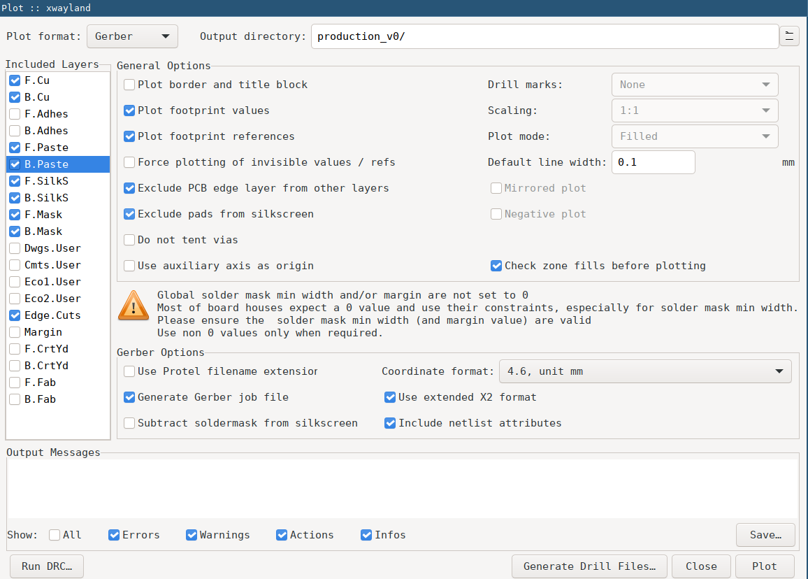
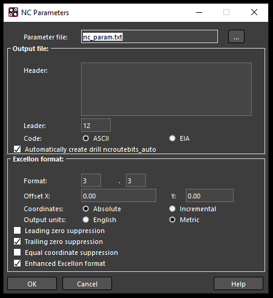
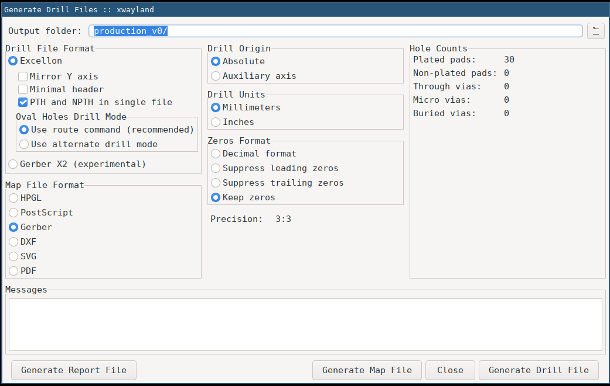
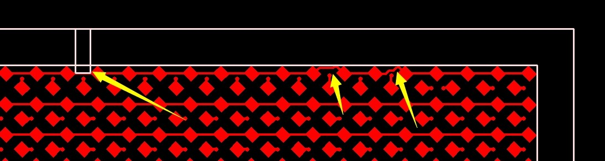
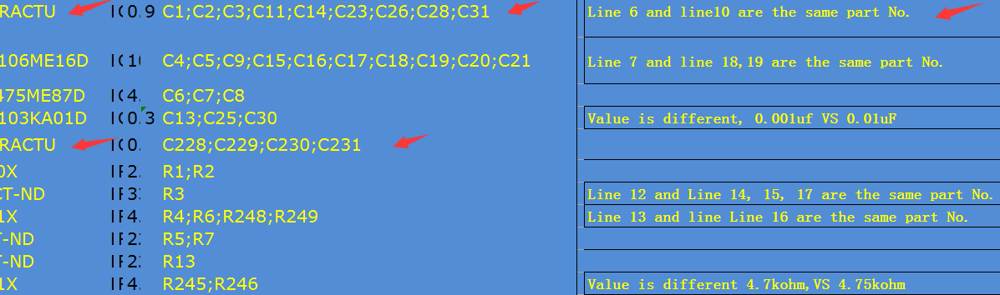
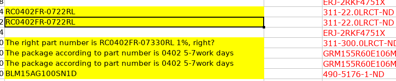
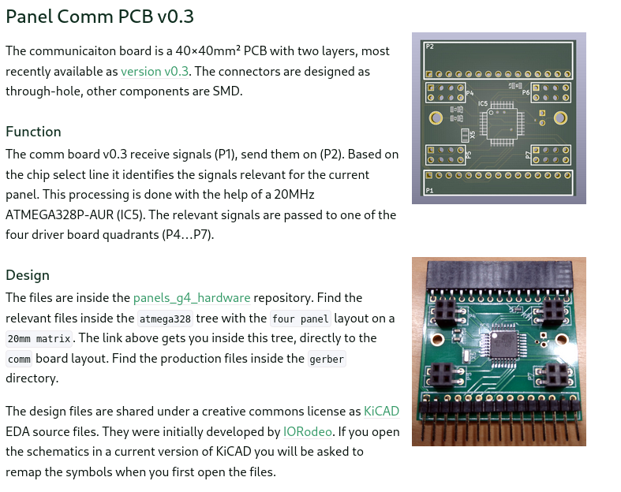
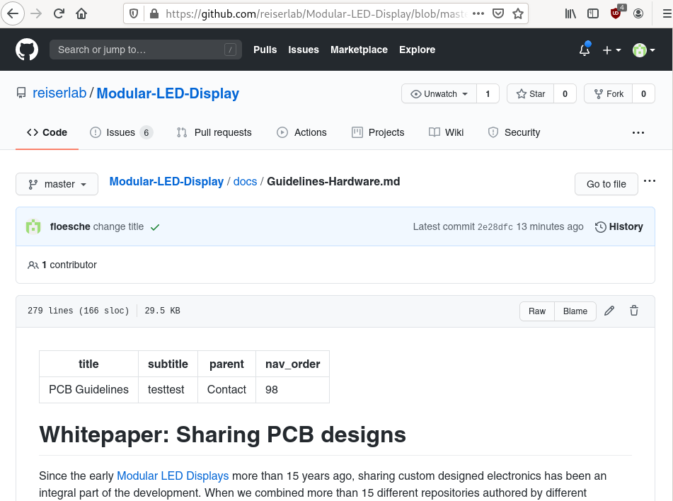
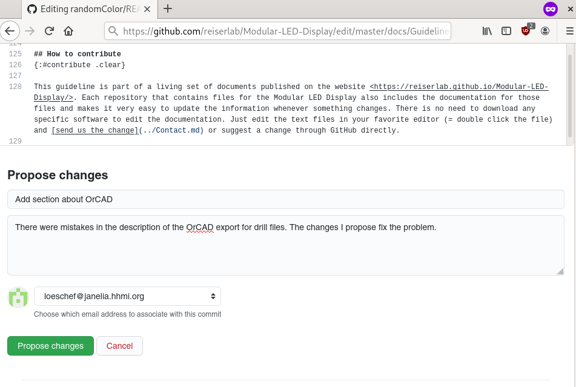

# Whitepaper: Sharing PCB designs

Since the early [Modular LED Displays](../index.md) more than 15 years ago, sharing custom-designed electronics has been an integral part of the development. When we combined more than 15 different repositories authored by various contributors into this website, the importance of having a consistent code and documentation quality became apparent. This document suggests how to achieve comparable coverage for printed circuit board (PCB) designs. This text's suggestions are based on experience from organizing the different generations of the displays and are driven by the idea to "publish early, publish often."

Please feel encouraged to share your modifications of the design by following the [checklist](#checklist). In case you want to know more details, we linked each checklist item with a more detailed description. Some of these sections contain links to "Further Readings" if you are looking for even more information. If you are unsure, please [get in contact](../Contact.md) or submit the files through [GitHub](#how-to-contribute): a not-yet-perfect file is often more useful for others than a finished and polished version not yet released.

## Checklist

We would appreciate the following files for each change. If you submit these files to us when you also send them to the manufacturer, there should be almost no additional work required. If you want to send intermediate versions between hardware revisions, we can use the repositories to keep track of that, too.

- [Schematic drawing](#schematic-design) (e.g., `*.pdf`)
- [PCB Design](#eda-design)  (e.g., `*.brd` for OrCAD or `*.kicad_pcb` for KiCad)
- [Gerber files](#gerber-files) (e.g., `*.art` for OrCAD or `*.gbr` for KiCad)
- [drill file](#drill-files) (e.g., `*.drl` for OrCAD and KiCad)
- [Bill of Materials](#bill-of-materials) (e.g., `*.csv` or `*.xlsx`)
- [Invoice or price estimate](#invoice) (e.g., `*.pdf` or text)
- [Short description and file version this was based on](#versioning)

While the above files should be available for each hardware revision, some of the files below are nice-to-have, but not crucial. Like the manufacturers' feedback, others depend on the assembler and can take different forms (e.g., emails, screenshots, update files) and follow different schedules. Others, like photos and renderings, are purely for improving the documentation.

- [placement file](#placement-files) (e.g., `*.txt`)
- [feedback from manufacturer](#feedback-from-the-manufacturers)
- [Schematics Design](#schematic-design) (e.g., `*.sch` for Cadence and KiCad)
- [suggestion for a version number](#versioning)
- [alternative license](#license)
- [rendering of boards](#renderings-and-photos)
- [photo of produced board](#renderings-and-photos)
- [suggestion for improving the documentation](#documentation)

## EDA Design

Two different toolsets are being used to develop PCBs for the Modular LED Display, namely [OrCAD](https://www.orcad.com/) and [KiCad](https://kicad-pcb.org/). While most of the [generated output files](#fabrication-files) follow industry standards and are reasonably similar to each other, the design files (or "sources") are not interchangeable. Each set of a component's design files are only available for one of the two toolsets, depending on who designed this particular module.

If your submission is based on an existing version from the repository, please let us know which one you used. You can use the repositories to archive any design-related file, from  project files such as the `*.pro` files for a KiCad project to component libraries. Please let us know if any of the files are not compatible with the currently used [license](#license).

mvOrCAD and KiCad both divide the design process into a [schematic design](#schematic-design) phase and a [PCB design](#pcb-design). Here a quick run through about which files would be interesting to share:

### Schematic design

The focus of the repositories is on the production of Modular LED Displays and, therefore, the PCB design. Yet, to understand the PCB design, it is necessary to track changes in the schematics. Therefore some visualization of the schematic drawing should be provided every time something has changed. In the past, these schematics were shown through documents such as `*.pdf` files. Other image formats like `*.png` files are not ideal, but better than nothing.

Since schematic drawings are generated from schematic design files, it can help track the schematic designs in the repositories, too. Both tools, OrCAD and (old versions of) KiCad, use the file extension `*.sch` for the schematic design files, while recent versions of KiCad switched to `*.kicad_sch`. Some of the designs can consist of several schematic files or additional library files containing details for used electrical components. Please provide all files necessary for opening the schematic. As a user of your toolset, you probably know best which files are required. 

The handover between the schematic design and the PCB design is, among others, a netlist file. Since the netlist can be generated from a valid schematic design file, it is unnecessary to keep track of these files in the repositories.

### PCB design

The purpose of the repositories and documentation is to enable other labs to produce their own Modular LED Displays. Different manufacturers and assemblers of PCBs might require slightly different versions of the fabrication files. Therefore it is necessary to share the PCB design files so that these labs can generate fabrication files according to their assembly houses. At this time (2020), some manufacturers also start accepting design files, for example, from KiCad to export the fabrication files in the exact format they need. So even if you decide not to share the schematic design files and only want to provide a schematic drawing instead, a shared PCB design file will make life easier for everyone.

PCBs for the Modular LED Displays were designed either with OrCAD or KiCad. The design files for OrCAD uses `*.brd` as a file extension while KiCad uses `*.kicad_pcb` at this stage. For example, the G4 panel driver starting with version 1, has been developed in OrCAD while the panel communication board is being developed in KiCAD. Consequently, the [driver board's repository](https://github.com/floesche/Panel-G4-Hardware) is used to track the latest design iteration in the OrCAD file format as a `*.brd` file. Similarly, the [comm board's repository](https://github.com/floesche/panels_g4_hardware/tree/master/atmega328/four_panel/20mm_matrix/ver3/comm/) contains the latest design iteration in a KiCad file format that uses the extension `*.kicad_pcb`.

Some designs might require additional files; please make sure to share all files that are necessary to open the PCB design file. For example, footprints of other components can be in a `*.kicad_mod` file.

## Fabrication files

"Fabrication files" is a set of files sufficient to produce the PCBs. The EDA tools generate the files from the PCB design files. Although file types are, in general, defined by industry standards, there are small differences between manufacturers and tools. OrCAD and KiCad support different settings for each of the generated files. It would be tedious to explain the various options. Instead, we list some best practices that create something similar to the lowest common denominator and have proven to work so far. We hope to improve these descriptions over time.

### Gerber files

Files in the [Gerber format](https://www.ucamco.com/en/gerber) describe the different layers of a PCB in a vector format. By now, all manufacturers can work with the "Extended Gerber format RS-274X". The Gerber format is ASCII based, which is well suited to track changes through git. The standard file extension is `*.grb`, and KiCad produces such files through the *File*{:.gui-txt} → *Plot*{:.gui-txt} menu. OrCAD generates RS-274X files with the extension `*.art`, which can easily be renamed – either on our side or the manufacturers' side.

Both tools generate one file per layer, for example, copper layers, the solder paste layers on front and back for surface-mount technology (SMT) boards, and the silkscreen. Some designs use additional files to describe the edge cuts or the application of adhesives. For a four-layer PCB, this can mean almost any number of Gerber files are produced, typically nine for an SMT board: 4×copper, front + back silkscreen, front + back solder paste, and edge cuts.

There is no standard for how the files are named. Therefore the manufacturers require a description of the order of files and other parameters such as board thickness and distance between layers. This is either done through an additional file often called `Assembly.art` (for OrCAD) or a human-readable JSON file with the extension `*-job.gbrjob` (for KiCAD).

#### KiCad

The following screenshot shows which options have worked well in the past. Note the coordinate format with units in mm and a precision of 4 before and 6 digits after the comma. Make sure to select the X2 format and generate a job file.

#### Further Readings

- [EuroCircuit: RS-274X](https://www.eurocircuits.com/RS274X-Extended-Gerber/)
- [Ucamco: Gerber Format](https://www.ucamco.com/en/gerber)
- [Bitelle: RS274x Gerber Files](https://www.7pcb.com/blog/rs274x-gerber-files.php)
- [Bay Area Circuits: Advantages of the Gerber X2 Format](https://bayareacircuits.com/advantages-of-the-gerber-x2-format/)

### Drill files

[Several drill file standards](https://en.wikipedia.org/wiki/PCB_NC_formats) are available, but the use is not as consistent across manufacturers as for the Gerber files. Nevertheless, the Excellon-2 drill format, an extension of the  IPC-NC-349 standard with the file extension `*.drl`, is widely supported and generated through OrCAD and KiCad. Similar to the Gerber files, Excellon drill files are ASCII-based file formats, allowing easy change tracking through git. The CAD commands generally follow the Gerber syntax, but there are a few differences and exceptions.

Emphasizing all file format features would be tedious, but a few settings seem to work better than others. Specifically, many manufacturing machines don't support the relatively new "repeat code," which makes the file shorter but computation on the manufacturing machines more complex. For example, the command `R50X004` would repeatedly drill a hole 50 times along the X-axis 4mm apart. Functionally this is the same as specifying all 50 locations. On the other hand, most CAM drills support the correct bit's automatic selection, so they can be specified in the file header instead of a description in an external text.

#### OrCAD

The OrCAD default configuration does not generate standard-compliant drill files, but the following settings have worked well. Note that *Auto tool select*{:.gui-txt} is chosen, and *Repeat codes*{:.gui-txt} is not – which is different from the default. The drilling should also be done by layer pair, which defines the starting and end layer for the drill, instead of generating a separate drill file for each layer.

In addition to the above options, OrCAD works best with setting the following *Parameters…*{:.gui-btn}. The format should have a precision of *3*{:.gui-txt} before and *3*{:.gui-txt} after the comma. The coordinates should be *Absolute*{:.gui-txt} and *Metric*{:.gui-txt}, and the *Enhanced Excellon format*{:.gui-txt} should be selected. No zero suppression or one of the trailing or leading suppression should all work well.

#### KiCad

In KiCAD, a similar result can be achieved by selecting the *Excellon*{:.gui-txt} file format with *PTH and NPTH in single file*{:.gui-txt}, an *Absolute Drill Origin*{:.gui-txt} and *Drill Units*{:.gui-txt} in *Millimeters*{:.gui-txt}. In this case, the screenshot shows how to keep all zeroes, which will be the only structural difference to the file generated in OrCAD with the options shown above.

#### Further Readings

- [OSHPark: Common Errors with Drill Files](https://docs.oshpark.com/troubleshooting/drill-issues/)
- [PCB Prime: Drilling and Drill File Tips](https://pcbprime.com/pcb-tips/drill-file/)

### Bill of Materials

The Bill of Materials (BOM) is a spreadsheet that matches the component names from design with actual physical components. Both tools, OrCAD and KiCad, can automatically generate these lists but might need some post-processing. Similarly to the drill files, there is no standard, but there are several recommendations and best practices. In general, `*.csv` and `*.xlsx` files are accepted, and we use both across the repositories.

Arguably the most crucial feature of a BOM is descriptive headers: the manufacturer will open the file and then try to match columns to the expected fields with as little manual intervention and margin for error as possible.

- **ID**, **Item**, or **Line #** (optional): unique row number
- **Qty**: number of components of this type
- **RefDes**: A single reference designator or a list of designators as used in the schematics
- **Description**: Generic description of part
- **Footprint** or **Package**: the components package
- **Manufacturer** (optional): Manufacturer name
- **MPN** or **Manufacturer #**: Manufacturer product number, e.g., `RMCF0603JT220R`.
- [SUPPLIER]PN, e.g., **DigikeyPN** (optional): PN of a specific supplier, e.g., DigiKey, Mouser, LCSC, for example, `RMCF0603JT220RDKR-ND`
- **Notes** or **Instructions**: Additional comments, for example, specify if it's OK to use a generic component from the **Description** or determine alternatives to the suggested part.

The ID is optional but can help during the communication with the assembler. For example, you can say that "item 24 can be replaced by…" in an email. 

The **RefDes** should be a unique value for your design, often a letter followed by a number such as `R1`, `C15`, or `U132`. 

The **Description** field can be used to describe the component. For example, a 220Ω resistor with ±5% tolerance, 100mW power, and a 0603 (1608 metric) package can be represented as `220 OHM, 5% 3/10W 0603`. You should also generate a separate **Footprint** column, which can help identify the smallest package or the number of contacts if the assembly house requires that information.

It is generally helpful to name a particular component even for rather generic components like capacitors, connectors, or resistors. For that, specify the **Manufacturer product number** and since that might not be unique, give a **manufacturer** name. For example, you could stipulate the **manufacturer** `Yageo` and the **MPN** `RC0603JR-07220RL`. 

If you know the supplier product number, you can specify it in additional columns. For example, the **DigikeyPN** could be `311-220GRDKR-ND`, the **MouserPN** `603-RC0603JR-07220RL`, and the **LCSCPN** `C114683`. Different assembly houses will use other suppliers and might prefer different manufacturers. Columns for different suppliers can be added whenever needed or known. A good search engine to find electronic parts and distributors is [Octopart](https://octopart.com/).

Finally, in the **Notes**, you can specify if it is `OK to use the generic part from the description`, which might be OK for resistors, but not for LEDs on the driver board. You can also use this column to specify alternatives; for example, `if unavailable, use Stackpole RMCF0603JT220R or resistor matching description`. You could even request `if unavailable, get in contact` if you have specific constraints for that part and want to be involved in finding an alternative. This is also the place to specify if components are consigned or if you are going to assemble them yourself.

#### Further Readings

- [CircuitHub: New features to improve BOM workflow](https://circuithub.com/post/new-features-to-improve-bom-workflow)
- [JLCPCB: Bill of Materials (BOM) File for SMT Assembly](https://support.jlcpcb.com/article/80-bill-of-materialsbom-file-for-smt-assembly)
- [Bittele: Bill of Materials for PCB Assembly](https://www.7pcb.com/blog/sample-bill-of-material-pcb-assemblies.php)
- [PCBWay: Files Requested for PCBA](https://www.pcbway.com/assembly-file-requirements.html)

### Placement file

For board assembly, especially using SMT technology, a placement file is required. This file is sometimes called centroid file after its file format, Insertion, Pick'n'Place, or XY file. This file can be generated by the software tools OrCAD and KiCad. Many manufacturers can produce them from the Gerber files, but since this takes a long time and is an error-prone process, it is recommended to provide them.

The centroid format is a text-based file format, either as a fixed-width spreadsheet or column separation similar to a CSV. The file extension is often `*.txt` (OrCAD), `*.csv`, or `*.pos` (KiCad) and recommendations are given in the [IPC](https://en.wikipedia.org/wiki/IPC_(electronics))-7351B design document. A pick'n'place file contains the following columns:

- **RefDes**: unique designator
- **Footprint** (optional): Description of the package, e.g., `0603R`
- **Mid X** or **Location X**: component's X location
- **Mid Y** or **Location Y**: component's Y location
- **Rotation**: component's rotation
- **Layer**: Top or Bottom (or `T` / `B`)

The **RefDes** is the same designator used in the design files and the BOM. Unlike the BOM file, there is only a single component per line in the centroid file.

The **Footprint** or **Package** column helps the assembler identify the best machine but is not considered essential as the information should be in the BOM.

The **Location** columns describe the components offset from the board origin. The board origin is the bottom left, as seen from the top side of the board. The units are given in inches. Usually, the center of the component is the reference for the placement, but for some parts like connectors or other off-centered elements, the reference is at a different location. Besides, some assemblers prefer the location of pin 1 as a reference. Some tools like OrCAD will ask you which location you want to write to your centroid file. If in question, choose to provide the file with mid reference. There are instances where all three types are provided in the same file, then using **Mid X/Y**, **Ref X/Y**, and **Pad X/Y** as columns names. For some of the Modular LED Display fabrication files, we have provided all three types of pick'n'place files.

The **Rotation** is a value in degree clockwise for parts on the bottom and counter-clockwise for parts on top. 

The **Layer** specifies where the component is placed. Consequently, it also defines how the location and rotation are interpreted. An LED on the top with a rotation of 90 should have the cathode pointing down; the same LED with a rotation of 90 on the bottom side will have the cathode point upwards. 

#### Further Readings

- [PCBWay: Files Requested for PCBA](https://www.pcbway.com/assembly-file-requirements.html)
- [Screaming Circuits: A few hints on the centroid file](https://blog.screamingcircuits.com/2009/12/a-few-hints-of-the-centroid-file.html)
- [JLCPCB: Pick & Place File for SMT Assembly](https://support.jlcpcb.com/article/79-pick-place-file-for-smt-assembly)

## Invoice

One topic that regularly comes up in conversations is the question about costs for a Modular LED Display. If you provide an estimate for the quote or invoice, we can add an anonymized version for outside labs. As there are huge differences between manufacturers and over time, other labs can follow up on the most relevant information.

Please provide this basic information: The **order date**, a **quantity**, **type of order** (e.g., PCB fabrication, assembly, parts order, or a combination of those), the **price you paid**, and if there is a difference, the initial **quote** you received. Some manufacturers allow sharing projects publicly with a **project ID**, which will allow others to order the same item. If you have such an ID for the project, it can simplify future orders by sharing this identifier.

#### Further Readings

- [PCBWay: share project](https://www.pcbway.com/project/)

## Feedback from the manufacturers

Engineering and design are iterative processes that can be improved through feedback. The manufacturing process offers the chance to enhance the Modular LED Displays by improving issues that the manufacturer's engineers and systems find. In many cases, an additional engineering feed is paid to the manufacturer, which often depends on the number of problems they have to fix on their side. For once, it would be a waste to not use the information you paid for. And secondly, having to solve the same problems repeatedly for similar orders over time is a waste of time and other resources.

Not all manufacturers provide feedback; sometimes, you have to explicitly ask for it. Also, the format, quality, and thoroughness of the feedback differ between manufacturers, and not all problems can be generalized to other manufacturers. Consequently, there is no simple recipe on how to use the input. Instead, here are a few examples of feedback and how this could become part of the next version.

### Traces and routing

{:.ifr}

Depending on the machines the manufacturer has at the shop, their process might be more sensitive to trace location, trace width, or distance between traces than the constraints defined in the design software. In this example, the two yellow arrows on the right point out that the traces come close to the edge. Since the margin of slack can be similar across different machines for different manufacturers, and if there is no other downside, it might be worth considering to reroute these parts. This could require updating the [design files](#eda-design) and then regenerating the next batch's [fabrication files](#fabrication).

On the other hand, the arrow on the left shows a problem related to the panelization for this particular manufacturer, where the exact location can not be generalized to other manufacturers. Unless you want to engineer the panelization into the component's design, this specific problem might not be worth considering for a general solution.

Other examples are the distance between traces: the design rule check (DRC) during the design might use a different constraint than the manufacturer's settings. Consequently, some traces might appear too close to each other or nearby a component. Suppose there is enough space on the board. In that case, it might be worth modifying that particular trace or even the rules in the [design file](#eda-design) instead of seeing the same error over and over across different manufacturers.

### BOM corrections

{:.ifr}

The automatic generation of BOM files through the design tools can lead to unexpected results.  Suppose there is a small difference in a component's specification, such as an additional space in the component description like `220Ohm` vs. `220 Ohm`. In that case, it can lead to duplicate BOM lines. Manufacturers bill per unique part, so reducing the number of lines in the BOM avoids potential problems and save money. In the example feedback on the right, a manufacturer has highlighted this particular problem for several lines, including the first, second, seventh, and eighth.

Some differences between the specified component and the description are minimal, or the context in which they are used makes it easy to find a replacement. Correcting the original design files can reduce the communication cycles for future orders. This will also prevent problems for cases where these differences actually matter, and a prospective manufacturer might miss that problem. Examples of this particular issue are shown in the above example for lines four and the last line.

{:.ifr}

Different suppliers use other product numbers, and different assemblers might get their components from various suppliers. Suppose a manufacturer identifies a problem with the product number. In that case, it might be worth checking if the column **MPN** really contains the manufacturers' product number and not the id from a supplier. In the example on the right, the BOM accidentally had a Digikey product number in the **MPN** column in lines two, three, and eight. Besides, if an assembler suggests the product number from a different supplier, it might save you some time and confusion down the road if you add a new column, e.g., for **MouserPN**. You might not need it immediately, but if you have the files open anyway and work through it, why not reduce future work.

Always try to keep the description of the package in sync with the actual part number. In the above BOM, the items in lines six and seven were specified as 0603 packages, but the part number suggests that these are really 0402 packages. Wrong sized can lead to faulty orders and unexpected costs: if the smallest component is smaller than specified throughout the quotation process and can lead to unforeseen delays.

By adding an additional column for a supplier in the BOM, this potential problem can be fixed. If the footprint of a component changes and might influence the PCB itself or several generated files, including pick'n'place and BOM, this might require an adaptation of the [design files](#eda-design).

### Drill files

{:.ifr}

In the past, [drill files](#drill-files) were especially error-prone. This is possibly caused by OrCAD's default settings that produce a non-standard file unless parameters are set correctly. In some instances, this is caused by missing configuration for the drill bit size in the header, as in the example from a manufacturer's feedback on the right. Not all manufacturers will complain about all errors; they will assume a default tool size or copy drill bit size from an assembly file. This copy&paste process on the manufacturer side adds a potential mistake to the PCB, which can easily be avoided by providing a valid drill file.

Since drill files are ASCII files, one way is to add the header information. "Further readings" in the [drill file section](#drill-files) provide some starting information on how to do this. In other cases, repeat codes caused the issue since not all machines support these newer file format features. While these issues can be fixed by editing the `*.drl` file as well, it is often easier to export another drill file following the suggestion in the [drill file section](#drill-files).

# Versioning

The file versioning loosely follows [Semantic Versioning](https://semver.org/). Within a generation, the version number has two components, for example, [comm-v0.3](../Generation 4/Hardware/docs/comm.md#comm-v0p3). This is an abbreviation for [Modular LED Display communication board version 4.0.3](../Generation 4/Hardware/docs/comm.md#comm-v0p3).

Components are considered incompatible between generations; hence the generation acts as the "MAJOR" version.

Each component of the Modular LED Display follows its own "MINOR" versioning. For example, functional improvements on the arena board do not require changing the version of drivers or other components. Since many of a display generations' repositories are independent of each other, the generation number does not need to be specified. Within the "Panels G4 Hardware" repository, the major version 4 is implicit, so that "version 0.3" automatically becomes 4.0.3.

Small changes, such as incremental improvements to design files or altered fabrication files based on the same design files, are acknowledged through the "PATCH" number. In the example above, version 4.0.3 is the 3rd patch of version 0 within generation 4 of the Modular LED Displays.

# License
{:#license}

Files on the repositories are published under the [CERN Open Hardware License weakly reciprocal version 2.0 (CERN-OHL-W)](http://cern.ch/cern-ohl) and/or the [Creative Commons Attribution ShareAlike 4.0 International (CC BY-SA 4.0)](http://creativecommons.org/licenses/by-sa/4.0/) licenses. If you require another license, send a request along with your submission.

# Documentation

Different applications and knowledge require various emphasis within the documentation. If you figured something out that wasn't documented before, then please consider [contributing](#how-to-contribute). Taking pictures during the hardware design and production is one of the things that are not essential, but useful to have:

## Renderings and photos

{:.ifr}

Visualizations help in identifying a version of a PCB or by documenting how it is used. When working on the design files, OrCAD, as well as KiCad, supports the 3D rendering of the PCB. This image can be used to see the silkscreen that might otherwise be hidden after assembling a PCB. Once the PCB was produced and arrives, a photo can be used to document how it actually looks. This is not very important and can be done whenever needed, but if the files are easily generated and available, why not add it to the repositories? An example from this website for the comm board is shown in the image on the right.

# How to contribute
{:.clear}

This guideline is part of a living set of documents published on the website <https://reiserlab.github.io/Modular-LED-Display/>. Each repository that contains files for the Modular LED Display also includes the documentation for those files and makes it very easy to update the information whenever something changes. There is no need to download any specific software to edit the documentation. Just edit the text files in your favorite editor (= double click the file) and [send us the change](../Contact.md) or suggest a change through GitHub directly.

With the following steps, you can make a suggestion directly through GitHub:

Choose the file you want to edit on GitHub, for example, this [Guidelines-Hardware.md](https://github.com/reiserlab/Modular-LED-Display/blob/master/docs/Guidelines-Hardware.md)

Click on the edit button with the pen icon, at which point you will be asked to log into GitHub (if you haven't done that yet):

You can now change the file directly. Ignore the first few lines between `---` and the second `---` or learn more about it in the [Documentation Guidelines](Guidelines.md). While editing the file, you can *preview changes*{:.gui-txt} and then switch back to *Edit file*{:.gui-txt} until you are happy with your changes. To save the changed version, write a short summary in one line and, if necessary, a longer description of what you did, and then click on *Propose changes*{:.gui-btn}. This creates a copy of the file in your GitHub account, called a "fork" in git lingo. Let us know about your proposition and click on *Create pull request*{:.gui-btn}.

