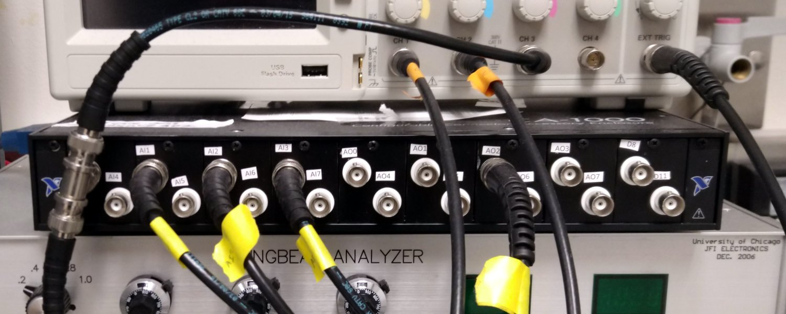
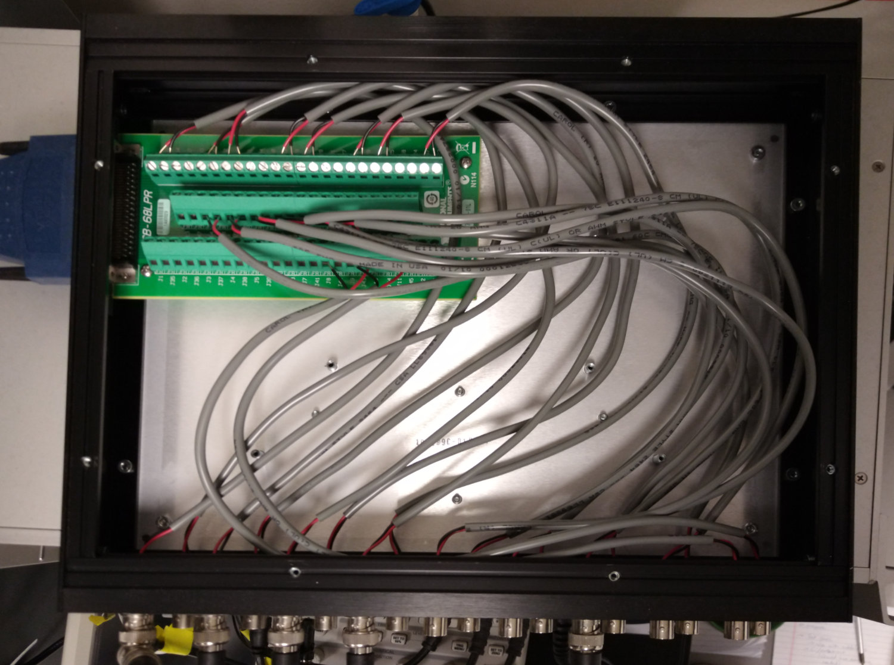

1. TOC
{:toc}

# Computer {#computer}

The computer acts as a controller for the arena and we recommend the use of a dedicated machine for this task. Two applications, namely MATLAB and a Simulink based custom application, need to run in parallel on this machine. The faster this machine the better, but we cannot give a recommendation on what the lower limit is. Most recently we used Dell Precision 5820 Workstations, but other recent PC with a PCIe slot will most likely work as well. The communication between computer and arena is realized through a specialized I/O card.

# Multi I/O card {#rio-card}

This is a FPGA based reconfigurable high speed IO device which can deliver the required multiple SPI channels within the anticipated time constraints. In addition, a connected [breakout box](#ni-breakout-box) allows easy recording several analog data channels through the same device that is used to record other experimental data.

The controller is implemented based on a National Instruments Multifunction Reconfigurable I/O device, specifically the [National Instruments PCIe-7842R](https://www.ni.com/en-us/support/model.pcie-7842.html). This card has 3 sockets of the "very-high-density cable interconnect" format (VHDCI). One connection will go to the [arena]({{site.baseurl}}/Generation%204/Arena/docs/arena.html) (eg through an [interconnect board]({{site.baseurl}}/Generation%204/Arena/docs/arena.html#interconnect)). Another one can be used with a [breakout box](#ni-breakout-box).

Note that the card does not always work in all PCIe slots in all computers. In our test systems, the card worked in 2 out of 5 slots, most likely because these slots had too little PCI lanes.

# VHDCI cable(s) {#vhdci-cables}

For the connection between PCIe card and interconnect board, you will need one [SHC68-68-RDIO](https://www.ni.com/en-us/shop/accessories/products/digital-cable.html?skuId=30215) cable. For the connection between the PCIe card and the [breakout box](#ni-breakout-box) a [SHC68M-68F-RMIO](https://www.ni.com/en-us/support/model.shc68m-68f-rmio-cable.html) cable was recommended. Both use the same connector, but we could only get reliable results when using the cables in the described way.

# NI Breakout box {#ni-breakout-box}

{:standalone .ifr data-img-class="pop"}

The breakout box takes a 68 pin VHDCI connection form the Multi I/O card as input and exposes some of those channels as BNC or D-sub connections.

We are currently using connector blocks like the NI [CB-68LPR](https://www.ni.com/en-us/shop/accessories/products/terminal-block.html?modelId=119553) inside a CA-1000 enclosure. We are using up to nine "BNC I/O Panelettes" (NI number 184737-01), each containing two BNC connectors.

{:standalone .clear .ifr data-img-class="pop"}

The CB-68LPR receives a number of signals from the NI-7842R card via the SHC68M-68F-RMIO cable and exposes them via labelled screw terminal blocks. In our behavioral setups we typically use four analogue input channels and one analogue output channel – which means three Panelettes could be enough. Nevertheless, find below the wiring suggestion for all 18 connections. The wiring is taken from the "NI R Series Multifunction RIO Specifications" document "372492C-01" page 10, which is available from the National Instruments website (see link [I/O Card section](#rio-card)). The first column contains the NI labels for "Connector 0 (RMIO)", the "Signal pin" column is the CB-68LPR label that is used for the BNC signal pin, the "Ground pin" column specifies the label for the BNC ring, and the "Suggested Label" is how we suggest to name label the BNC on the CA-1000 enclosure.

| RMIO labels        | Signal pin | Ground pin | Suggested Label |
|:------------------:|:----------:|:----------:|:---------------:|
| AI0+ / AI0-        | J68        | J34        | AI0             |
| AI1+ / AI1-        | J66        | J32        | AI1             |
| AI2+ / AI2-        | J65        | J31        | AI2             |
| AI3+ / AI3-        | J63        | J29        | AI3             |
| AI4+ / AI4-        | J62        | J28        | AI4             |
| AI5+ / AI5-        | J60        | J26        | AI5             |
| AI6+ / AI6-        | J59        | J25        | AI6             |
| AI7+ / AI7-        | J57        | J23        | AI7             |
| AO0 / AOGND0       | J55        | J21        | AO0             |
| AO1 / AOGND1       | J54        | J20        | AO1             |
| AO2 / AOGND2       | J53        | J19        | AO2             |
| AO3 / AOGND3       | J52        | J18        | AO3             |
| AO4 / AOGND4       | J51        | J17        | AO4             |
| AO5 / AOGND5       | J50        | J16        | AO5             |
| AO6 / AOGND6       | J49        | J15        | AO6             |
| AO7 / AOGND7       | J48        | J14        | AO7             |
| DIO11 / DGND       | J45        | J9         | D8              |
| DIO8 / DGND        | J10        | J8         | D11             |

# Arduino Uno {#arduino-uno}

The programmer is currently built around an Arduino Uno. The are widely available, for example at [1](https://store.arduino.cc/usa/arduino-uno-rev3) and [2](https://www.digikey.com/short/zr4nd5). The Arduino will be used to program the panel MCUs.

# Power supply {#power-supply}

In the past we have had no problems with 5V 10A power supplies such as [this one](https://www.adafruit.com/product/658) for typical arenas with around 40 panels. Depending on your setup, power supply with more or less amperage should work. The connectors on G4 arenas use a 2.1mm power connector with a positive center.

To estimate the power requirement, here an back-of-the-envelope calculation for a typical arena: Depending on the choices on LEDs and resistors you made during the acquisition of the [driver boards]({{site.baseurl}}/Generation%204/Panel/docs/driver.html), a single LED typically draws between 10 and 20mA when turned on. Because of the line scan algorithm, not more than 8 LEDs per quadrant are powered on at any time, so not more than 32 per panel. Since we use up to 4 different SPI busses, up to 128 LEDs can be turned on at the same time. This amounts to less than 3A for the light.

With 5 ATMega328 per panel (4 on the [driver]({{site.baseurl}}/Generation%204/Panel/docs/driver.html), 1 on the [comm board]({{site.baseurl}}/Generation%204/Hardware/docs/comm.html)) and 48 panels, up to 240 ATmega328 need to be powered all the time. Assuming another 20mA per MCU, this amounts to roughly 5A. Together with the 3A for the LEDs this ends at around 8A, which explains why a 10A works well in most setups.

The initial developer of the system suggested to budget roughly 0.25A for each used panel, which arrives at a similar result for typical setups.
