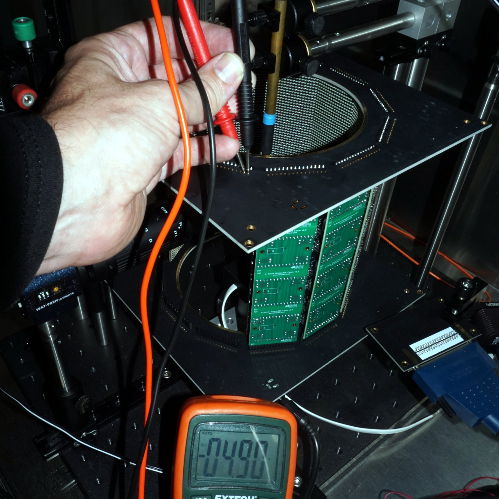
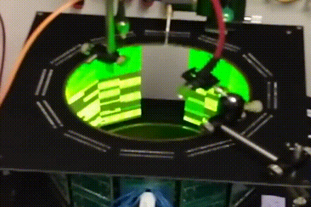

The classification of errors is not always possible and sometimes counterintuitive.

1. TOC
{:toc}

# Hardware

## Arena does not turn on

If the arena does not turn on, check that the connection between the interconnect board and the VHDCI cable is good. The VHDCI cables can sometimes need a very tight fit to make all the connections.

{:standalone .ifr data-img-class="pop"}

Using a voltmeter, check that the arena board is being supplied with 5V as expected. Assuming your panels are mounted with the pins down and the receptacles pointing upwards and you look at it from outside the arena, the most right pin is the power supply and the second is ground.

Some issues in the past have been caused by mistakes in the arena board assembly. The connectors between the arena board and the LED panels have sometimes been placed on the wrong side of the arena board or have had the gendered 15-pin connectors switched between the top and bottom arena boards. To see if this is the case, remove all of the LED panels from the arena board and plug one column back in, but inserted backwards (where the LEDs are facing to the outside of the arena). If an _all on_{:.gui-txt} command turns on the LEDs in this case, then the connectors were placed incorrectly.

## Computer freezes at startup

If your system freezes when clicking on _Start Log_{:.gui-btn} try to move the PCI card to a different PCI slot. On two recent machines (Dell Precision 5820) 2 out of 5 slots worked.

## Flickering LEDs

{:standalone .ifr data-img-class="pop"}

If you see some or all the LEDs flicker similar to the image on the right (or [this video](assets/g4_flickering_cable.mp4)), this could be caused by noise from a long ribbon cable. It can also be caused by insufficient power supply. To identify this, have a look at the error description for [Arena does not turn on](#arena-does-not-turn-on)

# Software

## `Error: Create Folder…`

If the `G4 Host.exe` reports _Error: Create Folder in FileIO […] HHMI – Generate File paths.vi…_{:.gui-txt}, make sure that the following directories exist within `C:\Program Files (x86)\HHMI G4\Support Files`:

- `Analog Output Functions`,
- `Functions`,
- `Log Files`, and
- `Patterns`.

Create empty directories if they don't exist.

## Status window error

If _Start Log_{:.gui-btn} leads to an error in the status window, then your application has insufficient access rights. In the Windows explorer, give _Full Access_{:.gui-txt} rights to `C:\Program Files (x86)\HHMI G4\Support Files\Log Files` for the _USER_{:.gui-txt} accounts.

## _Dequeue timeout_ is activated in PControl

After running `PControl_G4`, check the LabVIEW window to see if the green light labelled _dequeue timeout_{:.gui-txt} is lit. If it is, it may be that the transfer speeds between the PCIe card and the computer's memory is too slow. If the computer is relatively new/fast, one possible cause of this problem has been noted with newer Dell workstations, which can be fixed by updating the BIOS.

Regardless of the computer make/model, it may be worth updating the computer's BIOS and seeing if that helps, which can be done by finding your PC's manufacture support webpage and downloading the latest BIOS installer (e.g. for Dells: <https://www.dell.com/support/home/us/en/04>).

## "You must select a trial" or "Only one trial may be selected."

Some of the functionality in the [protocol designer]({{site.baseurl}}/Generation%204/Display_Tools/docs/protocol-designer.html) can only be performed on one condition at a time. If you get this error, scroll through all your trials and make sure one and only one condition is selected.

This error was first described in the [Protocol Designer trouble shooting guide]({{site.baseurl}}/Generation%204/Display_Tools/docs/protocol-designer.html#trouble-shooting)

## "You cannot edit that field in this mode."

Most modes only allow certain parameters to be changed. You are trying to edit a parameter within the protocol designer that is not available for the mode. Check the mode value for that condition and make sure it is correct for what you're trying to do.

This error was first described in the [Protocol Designer trouble shooting guide]({{site.baseurl}}/Generation%204/Display_Tools/docs/protocol-designer.html#trouble-shooting)

## "The value you've entered is not a multiple of 1000. Please double check your entry."

This is only a warning, not an error. The protocol designer ill not prevent you from continuing. However, best practices for the Analog Input sample rates suggest to use multiples of 1000, so this warning is there in case you miss a zero or otherwise typo a sample rate.

This warning was first described in the [Protocol Designer trouble shooting guide]({{site.baseurl}}/Generation%204/Display_Tools/docs/protocol-designer.html#trouble-shooting)

## "None of the patterns imported match the screen size selected."

Check the screen size at the center left of the protocol designer. The patterns you've tried to import were made for a different size screen than you have selected.

This error was first described in the [Protocol Designer trouble shooting guide]({{site.baseurl}}/Generation%204/Display_Tools/docs/protocol-designer.html#trouble-shooting)

## "If you have imported from multiple locations, you must save your experiment before you can test it on the screens."

This is also not an error, but a warning issued by the protocol designer. If you have not saved your experiment yet, then the folder this application thinks of as the "experiment folder" is the last folder you imported from. If you have imported from multiple locations and try to test a trial on the screens, it may not work if it cannot find the pattern or function it needs in the last location you imported from. You can avoid this issue by saving the experiment before you dry run a trial.

__Note__: There are plans in the works to remove this limitation and allow the software to track where each imported file comes from. Look for this in future releases.
{:.info}

This warning was first described in the [Protocol Designer trouble shooting guide]({{site.baseurl}}/Generation%204/Display_Tools/docs/protocol-designer.html#trouble-shooting)

## "Error using fileread. Could not open file HHMI Panels Configuration.ini."

If you get this error message regarding the configuration file or any other important file, check that the path to this file is correct in your settings and make sure the file is on your MATLAB path. If you get this error regarding the `G4_Protocol_Designer_Settings.m` file, make sure it is located in `G4_Display_Tools\G4_Protocol_Designer`. Do not move it from this location. If you get this error regarding the `recently_opened_g4p_files.m` file, please make sure it is located in `G4_Display_Tools\G4_Protocol_Designer\support_files`. DO NOT edit this file.

If everything is in the correct location, this error could mean that you as a user do not have permission to edit the file in question. Sometimes, especially if the configuration file is located in a root or program files folder, a user may not be allowed to edit those files unless their user profile is set to administrator privileges. If the user cannot edit the file, then the Designer cannot edit the file on the user's behalf. Fixing the permissions will fix the error.

This error was first described in the [Protocol Designer trouble shooting guide]({{site.baseurl}}/Generation%204/Display_Tools/docs/protocol-designer.html#trouble-shooting)

## Results not saved

When running the experiment, there is either an error message related to `TDMS`, or there will be no results recorded. In that case, please double check, that you don't have any old version of the TDMSReader installed on your machine, specifically not version 2.5. To check this, you can run the MATLAB command `contains(path, "TDMSReaderv2p5")` – a return value of `1` signifies that the old version is installed. Please remove it from your computer or at least from the MATLAB path.

This error should have been caught during the [G4 software setup]({{site.baseurl}}/Generation%204/Display_Tools/docs/software_setup.html).
