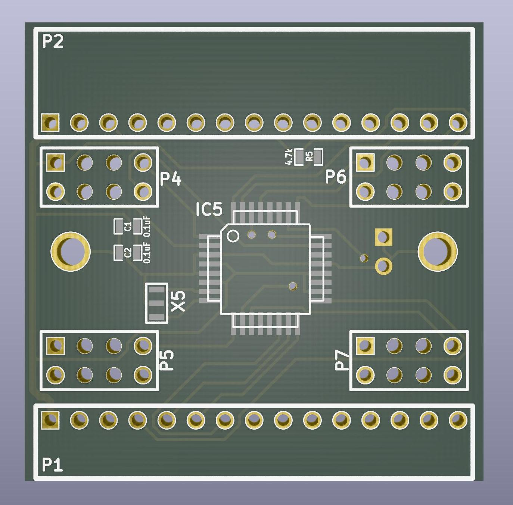
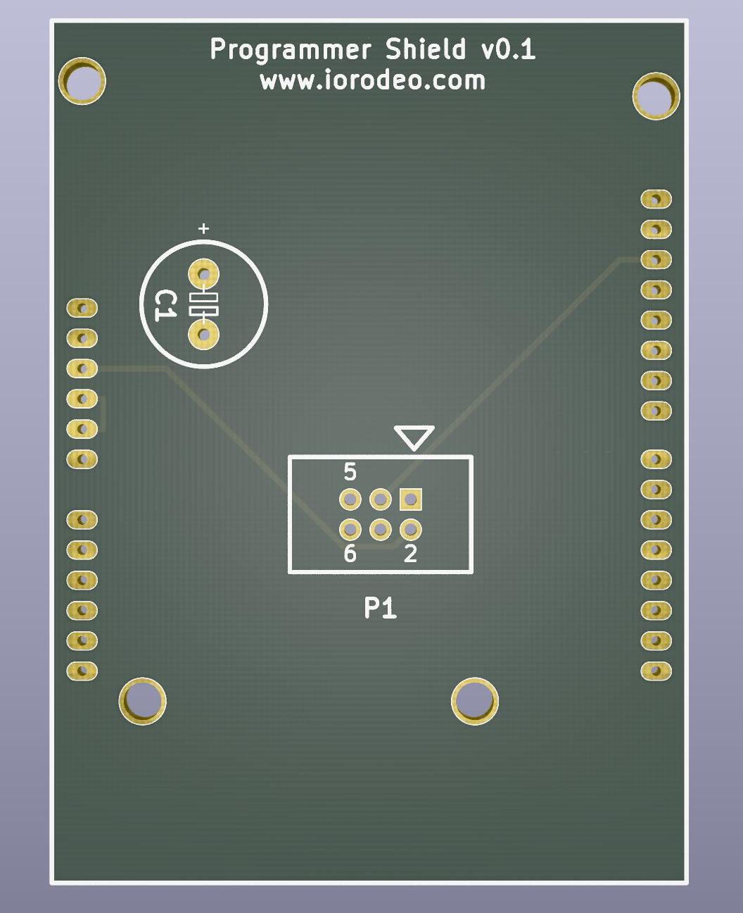
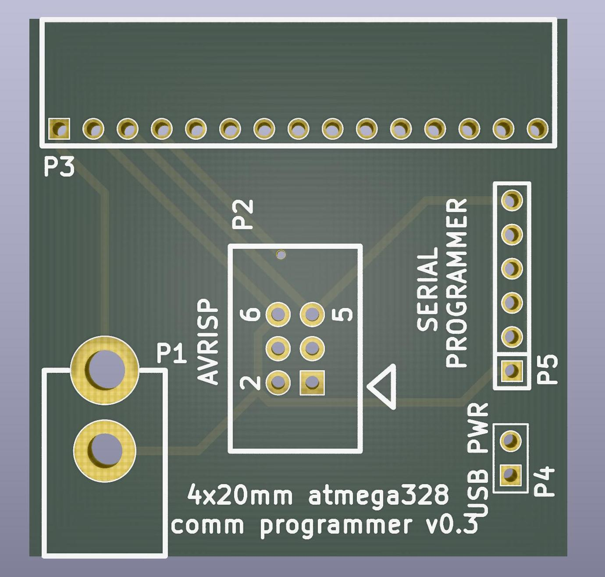
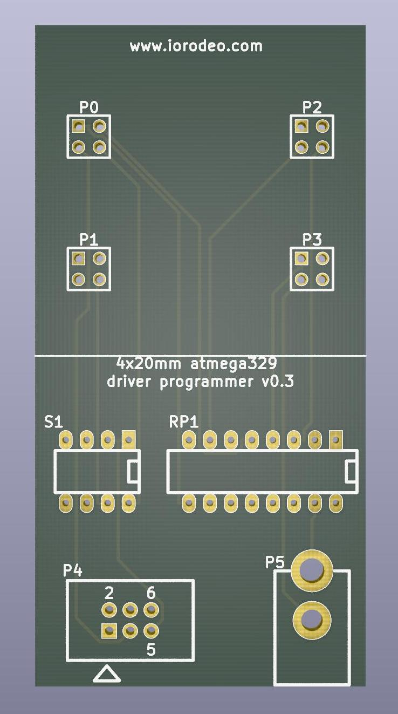

# Acquiring the hardware

This guide describes the parts that are needed for a modular LED display of Generation 4.

An assembled arena consists of the following larger building blocks: There are up to 48 LED panels placed between two arena boards. The whole setup is controlled from a dedicated computer and signals can be recorded via an additional breakout board. Most of these building blocks consist of several smaller parts. The following sections describe how these can be bought or manufactured.

# LED Panels

In Generation 4, the panels are 4×4cm² and consist of two PCBs: The one with the LEDs is sometimes called driver, the PCB behind it is the communication board or comm. The two PCB use board-to-board connectors, and the comm boards have two additional board-to-board connector to connect to the neighboring comm board or arena PCB. Both boards, driver and comm, have microcontroller units (MCU) that need to be programmed. Therefore an arduino based programmer is needed.

## Driver Board

The driver board is a 40×40mm² PCB with 6 layers, most recent production files are available as [version v1.5](https://github.com/floesche/Panel-G4-Hardware/tree/master/production-v1/). Most components on the driver board are SMD, factory assembly is recommended for these boards.

*Function:* receive signals on the four connectors (J1…J4), one for each quadrant. Each quadrant uses an ATMEGA328P-MU (U1…U4) to turn the LEDs (D1…256) on and off. The LEDs in each quadrant are organized in 8 columns × 8 rows. The ATMEGAs use a row-scan algorithm, where at each point in time a single row is active from which any number of the up to 8 columns are active. Each column uses its own resistor, therefore LEDs of different colors can be used for each column.

---

>  The driver board was designed in-house at Janelia's [jET](https://www.janelia.org/support-team/janelia-experimental-technology) group. The [OrCAD](https://www.orcad.com/) EDA source file is provided for reference, although the production files might have been generated from a different version.

## Communication Board 
{:.clear}

{:.ifr}

The communicaiton board is a 40×40mm² PCB with two layers, most recently available as [version v0.3](https://github.com/floesche/panels_g4_hardware/tree/master/atmega328/four_panel/20mm_matrix/ver3/comm/gerber_v0p3). The connectors are designed as through-hole, other components are SMD.

*Function:* receive signals (P1), send them on (P2), and find the signals relevant for the current panel. This processing is done with the help of a 20MHz ATMEGA328P-AUR (IC5). The relevant signals are passet to one of the four driver board quadrants (P4…P7).

## The Programmer
{:.clear}

The programmer is built from 3 PCB: An Arduino shield, the comm programmer, and the driver programmer. The three boards are designed to be assembled by hand: These simple 2-layer boards use very few through-hole components and only one of each board is needed for the setup of an arena. 

The use of the programmer will be explained in more detail in another section, but general principle is as follows: The Arduino shield needs to be mounted on an Arduino. The same shield can be used for programming the communication boards and the driver boards. Connect the corresponding programmer board via a ribbon cable to the Arduino shield, and the board you want to program to the programmer board.

{::comment}TODO: Add link to firmware flashing section{:/comment}
{::comment}TODO: Add images with of what programming looks like{:/comment}

---
{:.clear}

{:.ifr}

The Arduino programming shield measures 72.39×53.34mm². The gerber files and a drill file of the most recent [version v0.1](https://github.com/floesche/panels_g4_hardware/tree/master/atmega328/four_panel/20mm_matrix/ver3/programmer/prog_shield/gerber_v0p1) are the same as in the zip file, ready to be sent to the manufacturer. 

The basic functionality of the Arduino shield is to convert the signals from the Arduino connectors on the side the ribbon connector (P1).

---
{:.clear}

{:.ifr}

With 40×40mm² the PCB for the communication board programmer has the same dimensions as a communication board or a driver board.
  
Production files for the communication board programmer are available in [version v0.3](https://github.com/floesche/panels_g4_hardware/tree/master/atmega328/four_panel/20mm_matrix/ver3/programmer/comm_programmer/gerber_v0p3), also as a zip file ready for submission. The production files contain the gerber files, drill file, and a "Bill of Materials" (BOM) as an xlsx file (Office Open XML format used by Microsoft Office). 

*Function:* adapt the signal from the Arduino (P2) to the communication board connector (P3), while also powering the communication board during programming (P1).

---
{:.clear}

{:.ifr}

The driver programmer has double the size of a panel board, it is 40×80mm².

The most recent version of the production files is [version v0.3](https://github.com/floesche/panels_g4_hardware/tree/master/atmega328/four_panel/20mm_matrix/ver3/programmer/driver_programmer/gerber_v0p3). Once again this directory contains a zip file ready to be used with a manufacturer. The production files contain gerber files, a drill file, and a BOM.

*Function:* adapt the signal from the ribbon connector (P4) to the four driver board connectors (P0…P3), while also powering the driver board during programming (P5). The switch (S1) allows to select which driver MCU will be programmed (usually all 4 are on).

---
{:.clear}

> The texts for the programmers and communication board include links directly to the directory containing production files. From there you can navigate one directory up to see the [KiCAD](https://kicad-pcb.org/) EDA source files, in case you want to modify them. These boards were developed by [IORodeo](https://iorodeo.com) and shared under a creative commons license. The schematics might require remapping of symbols when you first open the files.

# Arena Board
{:.clear}

The arena board organized the panels in a geometry and provides structural integrity to the whole setup. Different shapes of cylindrical arenas have been built. They are often described by their number of panel columns populated and the virtual ones forming a full circle. A 12-12 arena is a closed cylinder formed by 12 columns in total. All of them can be populated in this design. A 12-18 arena is a cylinder that would be formed by 18 columns. Out of those, 12 can be populated. 

Here we share a 12-18 arena where the board occupies 299×206mm², designed as a PCB with 7 layers. The most stable production ready files are for [version v1.1](https://github.com/floesche/Arena-G4-Hardware/tree/master/arena_12-18/production_v1p1). There is also a version v2.0 being developed, but it is also more difficult and expensive to produce, since it uses hidden vias. The design was done in-house at Janelia.

## Arena Interconnect Board

The 12-18 arena v1.1 has a ribbon cable input. An additional Arena Interconnect Board adapts the VHDI cable to the required ribbon cable format. This board is a simple 2 layer PCB within the dimensions of 4.9×8.4mm². The production files are available in [version v1.2](https://github.com/floesche/Arena-G4-Hardware/tree/master/interconnect/production_v1). The design was done in-house at Janelia. Recent tests suggest, that the ribbon cable introduces noise in the communication. The ribbon cable should be as short as possible to reduce the noise.

# Computer and National Instruments card

Once the hardware is put together, the arena is going to be controlled from a dedicated computer. Two applications, namely MATLAB and a Simulink based custom application, need to run in parallel on this machine. The faster this machine the better, but we cannot give a recommendation on what the lower limit is. Most recently we used Dell Precision 5820 Workstations, but other recent PC with a PCIe slot will most likely work, too. This machine will need to have a National Instruments Multifunction Reconfigurable I/O device, specifically the PCIe-7842, installed. Note that the card does not always work in all PCIe slots. In our test systems, the card worked in 2 out of 5 slots.

# Checklist

To set up an arena, you will need the following items – all of which are described above.

- 1 Arduino Uno (buy one, e.g. at [1](https://store.arduino.cc/usa/arduino-uno-rev3), [2](https://www.digikey.com/short/zr4nd5))
- 1 Arduino Shield (build yourself)
- 1 Communication Board Programmer (build yourself, components according to BOM)
- 1 Driver Board Programmer (build yourself, components according to BOM)
- N Communication Boards (build yourself; N= number of panels; components according to BOM)
- N Driver Boards (build yourself; N= number of panels; components according to BOM)
- 2 Arena Boards (build yourself; one with components according to `BOM_Top.xlsx`, one with `BOM_Bottom.xlsx`)
- 1 Arena Interconnect Board (build yourself)
- Computer with PCIe slot
- National Instruments NI PCIe-7842R Card
