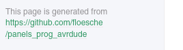

# Historic Background

In their publication ["A modular display system for insect behavioral neuroscience"](https://doi.org/10.1016/j.jneumeth.2007.07.019), Michael B. Reiser and Michael H. Dickinson introduce their system that is now know as "Generation 2". While the publication primarily focuses on the setup and data colleciton of this particular type of LED based flight arenas, the introduction gives a brief historic overview. This includes a link to Erich von Holst and Horst Mittelstaedt's 1950 publication of ["Das Reafferenzprinzip"](https://doi.org/10.1007/BF00622503) describing experiments that demonstrate the link between the central nervous system and peripheral neurons. It also lists other early uses of flight arenas, such as fixed patterns rotating around the insect as in [Karl Georg Götz' 1964](https://doi.org/10.1007/BF00288561) investigation of eye mutations, independent projections for each eye in [Karl Georg Götz' 1968](https://doi.org/10.1007/BF00272517) observation of motion perception, and earlier uses of LED arenas by [Strauss, Schuster, and Götz in 1997](https://jeb.biologists.org/content/200/9/1281).

As part of this current website, Mark Frye, Michael B. Reiser, and Michael H. Dickinson give another less formal introduction in [Theory and Practice of Insect Flight Simulators](../Generation 3/Software/docs/g2-user-guide.md). This document not only gives a historic overview of arenas, but also explains how to tether flies, and how to use an optical wingbeat analyzer. The last parts of the document describe the Panel Controller and other elements that were specific to the Generation 2 and Generation 3 arenas, but they also introduce terms that have been used since[^1].

To follow the history of the modular LED displays chronologically, you could dive into the detailed description of the [Generation 2](../Generation 3/Software/docs/g2-system.md) panel systems. That might only be of interest for historic reasons and if you are trying to fix an existing installation in your lab. 

{:.ifr}

More interestingly, you can find the documentation for [Generation 3](../Generation 3/) in the main menu. This documentation is not very consistent as it is pulled from many different sources. Therefore, the most value for you could be the links to all the different repositories (see partial screenshot above). Whenever you click on a menu, for example [Generation 3 → Firmware → Programming](../Generation 3/AVRDude/README.md) you will find a link on the bottom of the page saying "This page is generated from …". A click on that link will get you to an otherwise even more hidden repository with potentially useful files. Beyond software, these repositories contain all the files you need to repair existing hardware, from schematics to gerber files ready to produce replacements for broken panels or arenas of different configurations. 

[Generation 3](../Generation 3/) arenas are still used in many places. The spatial and temporal resolution is not as high as in [Generation 4](../docs/G4-index.md) setups, but they come at a lower cost and appear to be slightly more robust. On the downside they are more difficult to use: Experiments need to be transferred to the arena on an SD card and it is missing all the advanced tools to generate, run, and analyze experiments that Generation 4 has. So while there are good reasons to continue using existing Generation 3 installations, we discourage you from building new ones 

---

[^1]: If you come across terms in newer documentations that are not introduced properly, your best guess is to look them up in this early guide, but please also [let us know about it](../Contact.html) and we will fix this.
